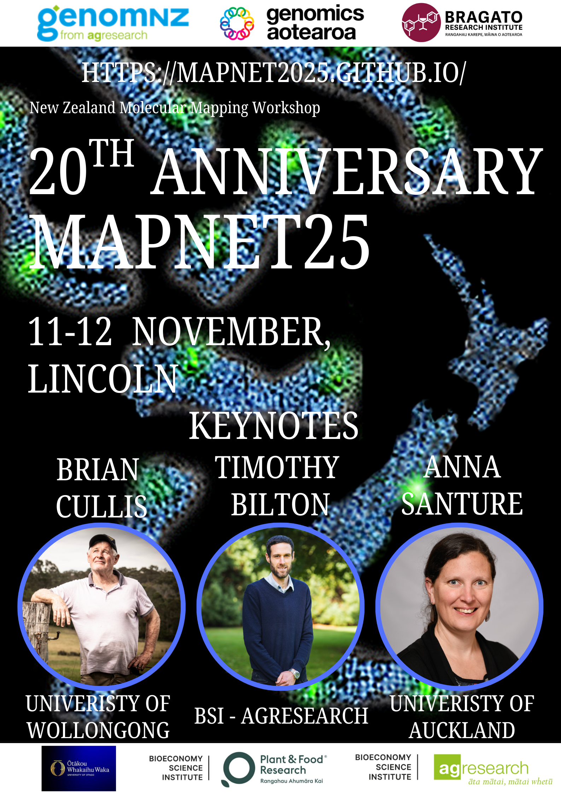
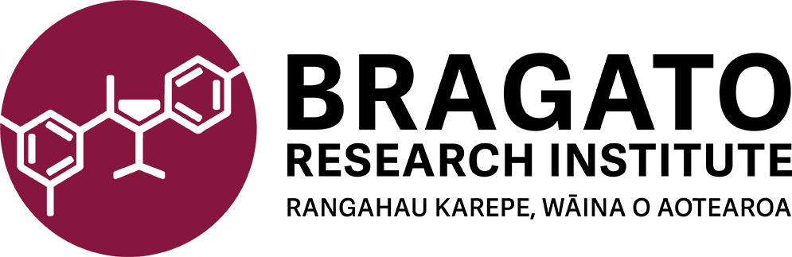
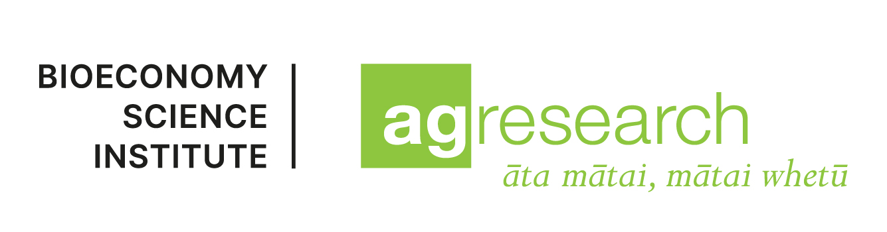
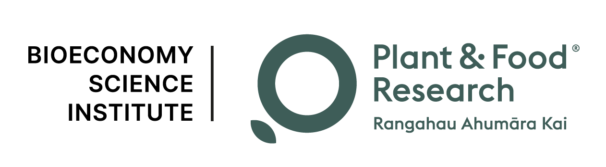
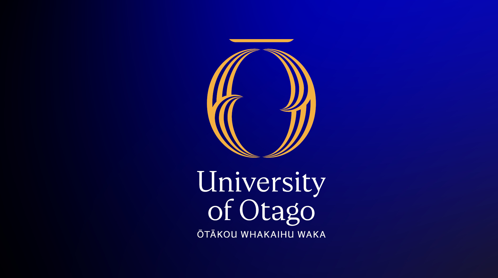
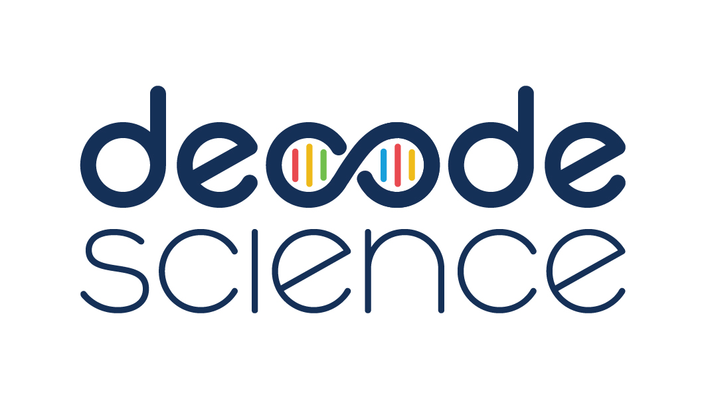
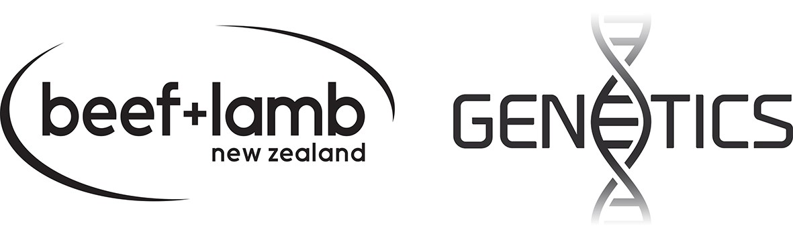

# Welcome to the 2025 MapNet meeting

MapNet2025 will be held where it all started 20 years ago on the Plant and Food campus in Lincoln, 11th - 12th November 2025.

Two workshops will be run in conjunction with this years MapNet.

- BLUP Methods Workshop: 10th November, 2025

- Consulting Māori communities on gene technology research Workshop: 13th November, 2025

- See [the Information page](https://mapnet2025.github.io/info/#workshops) for details on these.

<!--Registrations have now closed. 

#[**Click here for the conference programme**](https://github.com/MapNet2023/Mapnet2023.github.io/blob/main/assets/MapNet23_booklet.pdf)
-->

**Keynote speakers**

We are pleased to announce our 2025 keynote speakers:

- Professor Brian Cullis: University of Wollongong.

- Associate Professor Anna Santure: University of Auckland.

- Dr Timothy Bilton: BSI - AgResearch.

<!--
- Professor Elinor Karlsson: Director, Vertebrate Genomics, Broad Institute of MIT and Harvard.
    - _The Future of Comparative Genomics: Finding Meaning in DNA Sequence in a Million Genome Age_

- Professor Alison Van Eenennaam: Animal Genomics and Biotechnology, University of California, Davis.
    - _Global Status of Gene Edited Food Animals and their Products_
  
- Associate Professor Vinzent Börner: GHPC Consulting and Services Pty Ltd, Australia.
    - _Past, present and future of high performance computing in animal breeding_
 
- Dr Suzanne Rowe: Senior Scientist, Animal Genomics, AgResearch, Invermay.
    - _Using molecular phenotypes to lower global methane emissions_
-->

<!-- [**Click here for the conference programme**]()  (https://vuwgenomics.github.io/mapnet2019.github.io/pdfs/MapNet2019programme.pdf). -->

 <!-- **[Click here to register]**()(https://vuw.eventsair.com/mapnet-2019/mapnet2019). -->

## MapNet 2025

MapNet2025 themes include primary sector genomics, bioinformatics, integrating indigenous genomics into research and teaching, methodology advances, and ecological & evolutionary genomics. The program and times will be updated closer to the meeting date and posted here as a pdf.

## Sponsors

[.jpg)](https://www.agresearch.co.nz/partnering-with-us/products-and-services/genomnz/)

<!--## Sponsors 2023

#{:target="_blank"}

#

#{:target="_blank"}

#

#[.jpg)](https://www.agresearch.co.nz/partnering-with-us/products-and-services/genomnz/){:target="_blank"}

#

#{:target="_blank"}

#

{:target="_blank"}

{:target="_blank"}

<!--#{:target="_blank"}

#

#{:target="_blank"}

#

#{:target="_blank"}
#
-->

<!--  -->
   
<!--  -->

